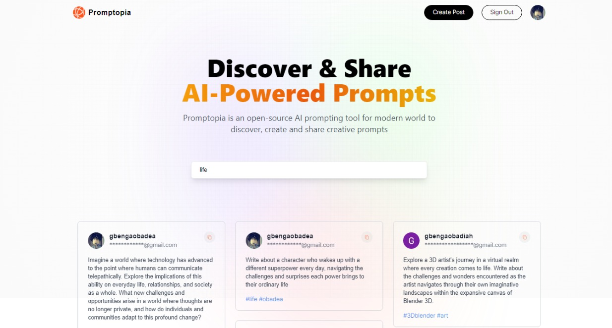

# Promptopia

Welcome to Promptopia, a social app where creativity flourishes! Share, discover, and engage with prompts created by users. Express your imagination, edit your prompts, and dive into a world of endless inspiration.

## Features

- **Create and Share Prompts:** Post your creative prompts for others to explore and respond to.

- **Edit and Delete:** Have the freedom to modify or remove your posted prompts.

- **Search by Tags or Keywords:** Easily find prompts based on specific tags or keywords, making it simple to discover content tailored to your interests.

- **Endless Creativity:** Immerse yourself in a platform designed to spark creativity. More exciting features are on the horizon!

# View Project

[Visit Promptopia Website](https://obadea-project-promptopia.vercel.app/)

# Preview



## Getting Started

1. **Clone the Repository:**
   ```bash
   git clone https://github.com/Obadea/project_promptopia.git
   cd promptopia
   ```
